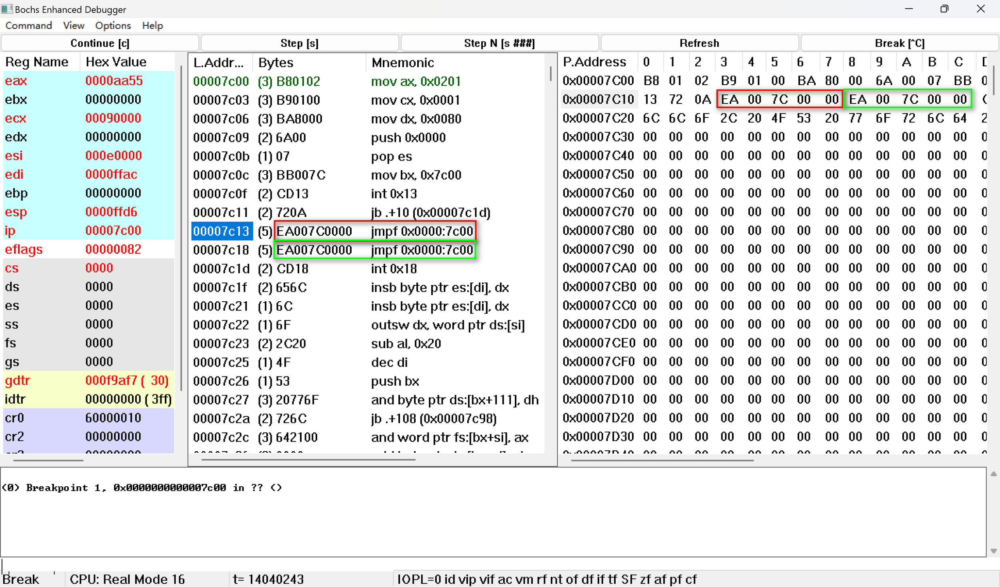
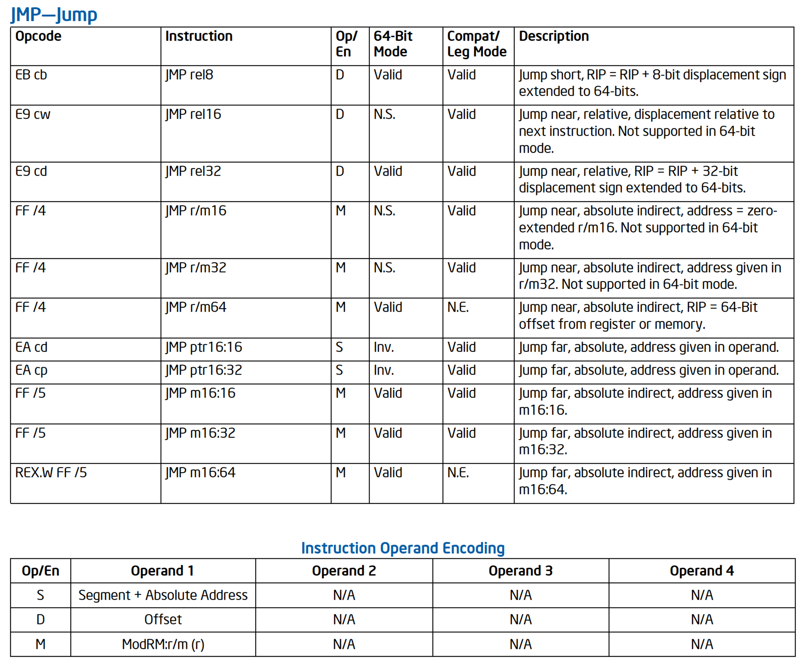
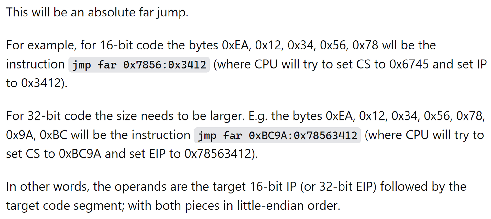

# Manually_Encode_Jmp_Instruction

- [Manually\_Encode\_Jmp\_Instruction](#manually_encode_jmp_instruction)
  - [Purpose of the `db 0eah` and `dw 7c00h, 0` vs `jmp 0x0000:0x7c00`](#purpose-of-the-db-0eah-and-dw-7c00h-0-vs-jmp-0x00000x7c00)
  - [Assembly View](#assembly-view)
  - [Disassembly View](#disassembly-view)
  - [JMP Instruction](#jmp-instruction)
  - [JMP Explanation](#jmp-explanation)

## Purpose of the `db 0eah` and `dw 7c00h, 0` vs `jmp 0x0000:0x7c00`

The `db 0eah` and `dw 7c00h, 0` lines are used to manually encode a far jump instruction (`jmp far`). In x86 assembly, the `jmp far` instruction is typically represented by opcode `0e9h`, but in this case, it seems the author chose to represent it manually using the `db` (define byte) and `dw` (define word) directives.

The opcode `0eah` is the machine code representation for a far jump. The `dw 7c00h, 0` encodes the destination address of the jump as `0000h:7c00h`. The first word (16 bits) represents the offset, and the second word represents the segment. In this case, it's a jump to the address `0000h:7c00h`, which is where the bootloader is loaded in memory.

So, in essence, `db 0eah` and `dw 7c00h, 0` together serve the purpose of a far jump instruction without explicitly using the `jmp` mnemonic. It's a way of manually encoding the opcode and the destination address of the jump. I appreciate your attention to the details of the code.

## Assembly View

```
    org    07c00h
int19:
    mov     ax, 201h
    mov     cx, 1
    mov     dx, 80h
    push    0
    pop     es
    mov     bx, 7c00h
    int     13h
    jc      int19err
    ;implicitely jmp far 0000h:7c00h
    db      0eah
    dw      7c00h, 0
    ;explicitely jmp far 0000h:7c00h
    jmp     0x0000:0x7c00
int19err:
    int     18h
```

## Disassembly View



## JMP Instruction



- Volume 2, Chapter 3, Sector 3.3 JMP—Jump

[Combined Volume Set of Intel® 64 and IA-32 Architectures Software Developer’s Manuals](https://www.intel.com/content/www/us/en/developer/articles/technical/intel-sdm.html#inpage-nav-1)

- [JMP -- Jump](https://pdos.csail.mit.edu/6.828/2018/readings/i386/JMP.htm)
- [JMP — Jump](https://www.felixcloutier.com/x86/jmp)

## JMP Explanation


