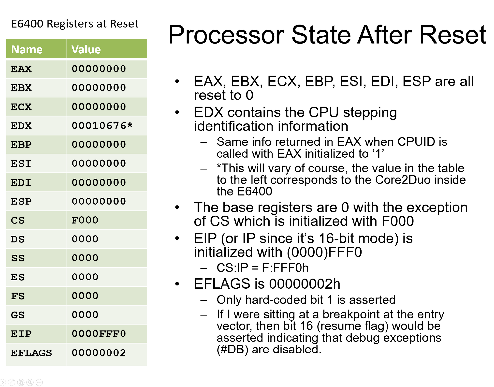
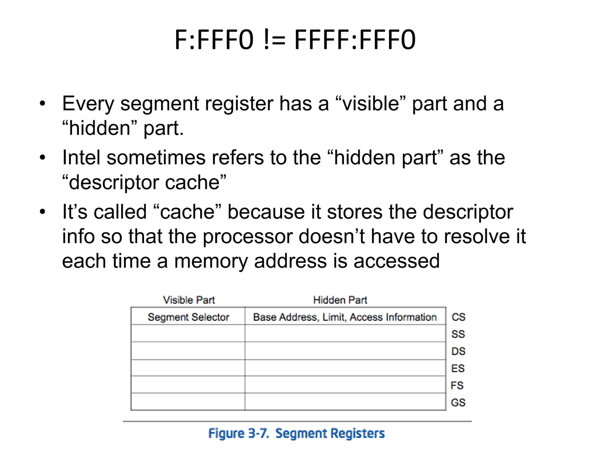
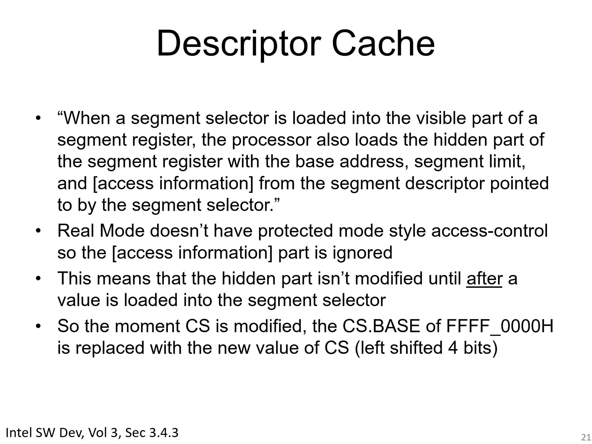
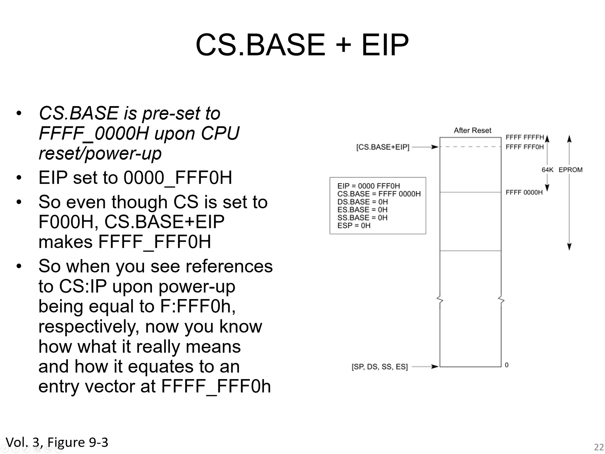
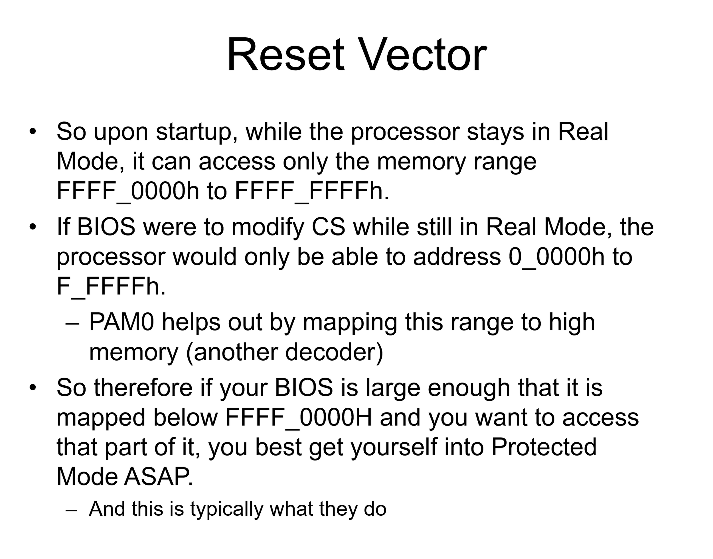

# Reset Vector ([Basics](https://github.com/linuslau/kOS-Notes/blob/main/Q&A/003_0xFFFFFFF0/README.md))

- [Reset Vector (Basics)](#reset-vector-basics)
  - [Why Reset Vector is 0xFFFFFFFF0，when CS=0xF000, IP=0xFFF0?](#why-reset-vector-is-0xffffffff0when-cs0xf000-ip0xfff0)
  - [Why is the first BIOS instruction located at the "top" of a 4 GB RAM?](#why-is-the-first-bios-instruction-located-at-the-top-of-a-4-gb-ram)
  - [What would happen if my computer only has 1 GB of RAM?](#what-would-happen-if-my-computer-only-has-1-gb-of-ram)
  - [How can it acess the memory \> 1MB (0xFFFFFFF0H) even processor is in real-mode?](#how-can-it-acess-the-memory--1mb-0xfffffff0h-even-processor-is-in-real-mode)
  - [Why x86 Reset Vector being at 0xFFFFFFF0 instead of 0xFFFFFFFF?](#why-x86-reset-vector-being-at-0xfffffff0-instead-of-0xffffffff)

## [Why Reset Vector is 0xFFFFFFFF0，when CS=0xF000, IP=0xFFF0?](https://opensecuritytraining.info/IntroBIOS_files/Day1_XX_Advanced%20x86%20-%20BIOS%20and%20SMM%20Internals%20-%20Reset%20Vector.pdf)

Normally, in real mode, address = 16_bit_CS.value << 4 + ip, it is equal to 0xFFFFFFF0

Yes, after power-up, all x86 CPUs are in Real Mode but with a strange behaviour until a CS assignment is found!!!.

Being finished reading some x86 documentation, these are the facts:

After power-up, 'CS register', 'CS cache register' and 'EIP' initial values are:
CS= F000h (16 bits wide as it should always be!)
CS_segment_start_address= FFFF_0000h (a 32 bits value, pointing somewhere in RAM?). CS_segment_lenght= 0_FFFFh (a 20 bits size value, yes, this is 64KB).
CS_segment is 'Present' in memory.
CS_segment is a 'Read/Write' chunk.
CS_segment has been 'Accesed'.
EIP= 0000_FFF0h

Now, take note of the following fact of life.
==SOF== (Start of Fact)
When fetching a new instruction (being in whatever mode: real, protected, etc) it seems that the hardware addressing logic is always using some 'CS cache register' values to figure out what address to place on the Address Bus pins. Specifically:
Next_Instruction_Address_on_Bus= CS_segment_start_address + EIP
==EOF== (End of Fact)

So, after power-up we have these numbers:
Next_Instruction_Address_on_Bus= FFFF_0000h + 0000_FFF0h= FFFF_FFF0h
This means, do we have access to the last corner of RAM after power-up, far away from the 1MB limit? Yes!!!. Holy grial!!!.

But wait, don't run and jump yet!!! This is just intended to place (by the software developer) a 'far jump' to some code chunk which it will be located in the BIOS ROM area hopefully!.

However, it is the motherboard who ensures that the instruction at the reset vector (0xFFFFFFF0h) is a far jump to the memory location mapped to the system BIOS entry point (0x0000: 0x000F0000h). In summary, every 'motherboard' has implemented this 'jump hack'. [Gustavo Duarte has a good explanation. Check his smart blog: http://duartes.org/gustavo/blog/post/how-computers-boot-up]

Following the explanation from above, that last 'far jump' mentioned is what it will update the 'CS_segment_start_address' with a well behaved 'Real Mode' value:

An assignment like CS= XYZWh (done with a far 'jump', far 'call' or any other) is translated to:

CS_segment_star_address= 000X_YZW0h (where XYZW are the CS nibbles values)

Back again in bussiness as usual with the 4 bits left-shift, 1MB limit, 64KB segments length cr..p!!!

A final few words, I guess this behaviour is to assure that your power-up (boot?) code will always be at the last corner of RAM. That way it will leave alone plenty of RAM for future OS disposal. (Honestly, for me, it will make more sense to have placed this 'Reset' vector within the 'Interrupt Vector Table' @ vector #0).

Please, correct me if I am wrong. Hope this helps.

PD: What is CS cache register? Well, it is the descriptor values associated with a CS selector in use. All other segments have this 'cache register' values too for fast accessing. And remember, on x86 CPUs you can not disable 'segmentation' at will. You have to deal with it. Read some 'Protected Mode' involving segmentation to know more... Unfortunately (or fortunately?) segmentation is gone and obsolete. Paging has succeded as a protection mechanism instead.

By the way, some Wikipedia articles seem to be edited with bad logic. Be careful about it!!!

## Why is the first BIOS instruction located at the "top" of a 4 GB RAM?

- First, this has nothing to do with RAM, really. We're talking about address space here - even if you only have 16 MiB of memory, you still have the full 32 bits of address space on a 32-bit CPU.

- And remember, at this stage, RAM memory is not even setup, and VGA memory (which is different from RAM) is not even available and initialized.

- It isn't located at the top of RAM; it is located in ROM whose address is at the top of the memory address space, along with any memory on expansion cards, like Ethernet controllers. It is there so that it won't conflict with RAM, at least until you have 4 GB installed. Systems that have 4 GB or more of RAM can do two things to resolve the conflict. Cheap motherboards simply ignore the parts of RAM that conflict with where the ROM is located. Decent ones remap that RAM to appear to have an address above the 4 GB mark.

- It's located at the "top" of 4 GB address space - and on power-on the BIOS or UEFI ROM is set to respond to reads of those addresses.

## What would happen if my computer only has 1 GB of RAM?

- A 32-bit CPU has 4,294,967,296 addresses, numbered 0 (0x00000000) to 4294967295 (0xFFFFFFFF). ROM can live in some addresses and RAM can live in others.

- The physical address space is used for RAM, and ROM, and memory mapped devices. The ROM (and not RAM) will be just below the "4 GiB" address. For example, if the ROM is 2 MiB, then it'd be in the physical address range from 0xFFE00000 to 0xFFFFFFFF. Note that at power on firmware can not use RAM (it has to figure out what type and size of memory modules are installed and configure the memory controller to suit, before it can expect RAM to work).

## How can it acess the memory > 1MB (0xFFFFFFF0H) even processor is in real-mode?

The address FFFFFFF0H is beyond the 1-MByte addressable range of the processor while in real-address mode. The processor is initialized to this starting address as follows. The CS register has two parts: the visible segment selector part and the hidden base address part. In real-address mode, the base address is normally formed by shifting the 16-bit segment selector value 4 bits to the left to produce a 20-bit base address. However, during a hardware reset, the segment selector in the CS register is loaded with F000H and the base address is loaded with FFFF0000H. The starting address is thus formed by adding the base address to the value in the EIP register (that is, FFFF0000 + FFF0H = FFFFFFF0H). The first time the CS register is loaded with a new value after a hardware reset, the processor will follow the normal rule for address translation in real-address mode (that is, [CS base address = CS segment selector * 16]). To insure that the base address in the CS register remains unchanged until the EPROM based software initialization code is completed, the code must not contain a far jump or far call or allow an interrupt to occur (which would cause the CS selector value to be changed)

Almost nothing inside the CPU cares about "CPU mode". When executing normal instructions; what actually matters are things like default code size, segment base, segment limit, segment type, etc., and the CPU mode is irrelevant. It's only things like segment register loads and interrupt handlers where CPU mode matters (in fact, other than paging, I'd wouldn't be surprised if the only things that care about CPU mode are things implemented in micro-code).

Because CPU mode is mostly irrelevant for normal instructions (and because things like default code size, segment base, segment limit, segment type, etc. are the only things that actually matter); at power on or reset the CPU can set "abnormal" values (values that aren't normally possible for the CPU mode) into segment registers and the rest of the CPU won't care. Specifically; it can do "CS.base_address = 0xFFFF0000" (which isn't possible for real mode where a CS segment register load would do "CS.base_address = 16_bit_CS.value << 4").

The end result is that all memory accesses that involve CS (and pass segment limit checks) end up going to the (linear) address "0xFFFF0000 + offset" even though the CPU is in "real mode" and even though this isn't normally possible for real mode.

Note that in real mode addresses are not limited to 1 MiB. For example, if you load 0xFFFF into a segment register then CPU will set that segment register's hidden info to "segment.base = 0x000FFFF0" and addresses using that segment will end up with (linear) addresses from 0x000FFFF0 to 0x0010FFEF. This is why (when 80286 was released) we needed the "A20 gate" for compatibility with ancient software (to force the 20th address bit to be zero without the CPU knowing).

Also note that while "CS.base_address = 0xFFFF0000" isn't normal for real mode; software can switch to protected mode and load a "code size = 16-bit, segment limit 64 KiB, segment base = 0xFFFF000" descriptor into CS; and then switch back to real mode without reloading CS. The end result would be the same "abnormal CS base" that the CPU sets up at power on or reset.

Of course (regardless of how an abnormal value got into CS.base) any normal CS segment register load that's executed in real mode will cause "CS.base" to be set to a normal value; so firmware would have to be ensure that no CS segment register loads occur while it's executing in "real mode" at the abnormal address.

## Why x86 Reset Vector being at 0xFFFFFFF0 instead of 0xFFFFFFFF?

x86 instructions often take up more than one byte, and a reasonable reset routine will almost certainly point to multiple instructions.

If the Reset Vector were to refer to 0xFFFF_FFFF, then only a single byte instruction would fit into that memory mapping; almost any useful reset functionality would thus require instructions that cross the 0xFFFF_FFFF/0xFFFF_0000 linear address boundary (since the code segment is set up with base 0xFFFF_0000)

By placing the reset code at this address, it's possible to fit a few instructions (including a jump) without requiring valid memory at 0xFFFF_0000.

The reason why it is 16 bytes below the top of memory comes from how the original 8086 CPU registers were loaded during reset. And even that may have something to do with compatibility for older 8085 CPU. And this compatibility has been carried over to later chips, such as 80286, 80386, etc.

Sure, they could have selected any value, but since interrupt vectors are fixed at the bottom of the memory area where it is intended to have RAM, the program ROM is intended to be put into the top of the memory area.

While any address in the top of the memory could be selected, it makes sense to be as close as possible to the last memory addresses, so that it does not dictate how large the ROM area must be, and you can use as small ROM as you can.

And it must not be too close to the last memory address either, to provide enough space for instructions to at least jump to execute code somewhere else. A short jump opcode is two bytes, near jump is three bytes, and the far jump takes 5 bytes, so it makes sense to reserve at least 5 bytes for the area.

As the 8086 has a 20-bit (or 1 megabyte) address space, and the designers chose it uses segmented memory approach where you have a 16-bit segment and 16-bit offset to point to a linear 20-bit address. It means that each segment register can select a base address for a 16-bit offset with a base address granularity of 16 bytes. Basically, the addressing of the 16-bit 8085 was just expanded with the addition of segment registers.

So during hardware reset, the program counter (IP) register is set to 0x0000, just like on a 8085 CPU. And to get to the end of memory, the code segment (CS) register is set to 0xFFFF. This makes the CPU start from 16 bytes from end of memory.

There are many valid CS:IP combinations that add up to the linear address of 0xFFFF0, but this really was most likely the simplest method, as all of the bits in the register are loaded with the same value, IP with zero bits, and CS with one bits, so loading a special combination of bits to either register was not necessary.

However, later CPUs already broke this compatibility somewhat, but in a way that it does not matter much.

For example, a 80286 loads the IP register with 0xFFF0. And since it uses 24-bit memory bus to access 16 Mbytes of memory, and the ROM must still be at the end of the 16 Mbyte addressable memory, the CS register value is reset to 0xF000, so that real mode CS:IP points to 0xFFFF0, and the CS selector base is set to base address of 0xFF0000 to set the physical memory base, so that the physical address is 0xFFFFF0. This way, if you just redesigned the old 8086 system to have a 80286, it could be made compatible to boot the original ROM.

When that got expanded to the 32-bit 80386, it also loads the 32-bit IP register with 0x0000FFF0, the CS register with 0xF000, and the CS selector base with 0xFFFF0000, so the physical address is 0xFFFFFFF0. So if a 80286 system was redesigned to take a 80386SX CPU, it could be made compatible to boot the original ROM.