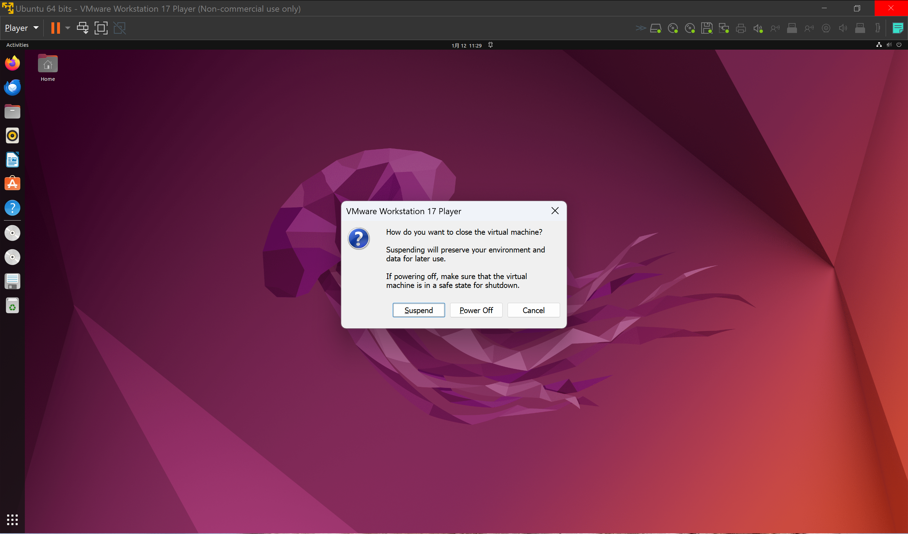
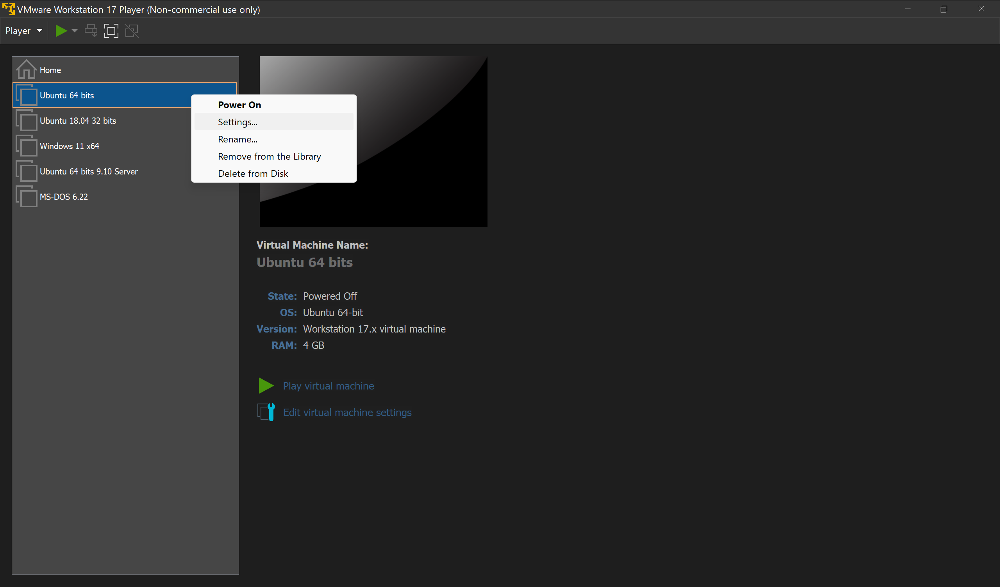
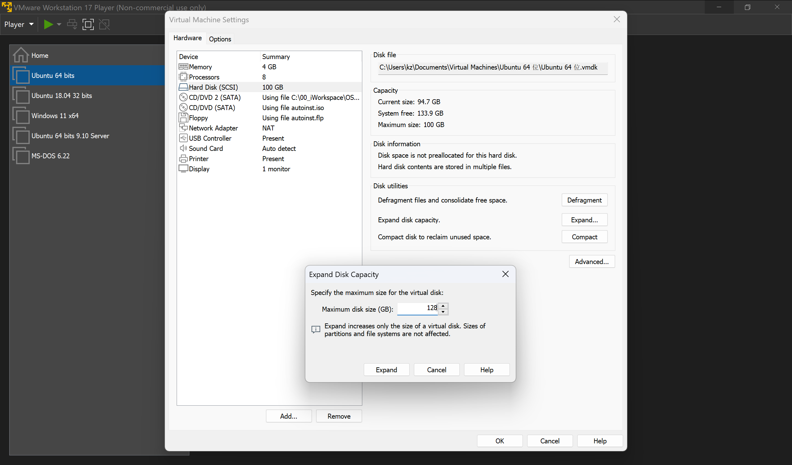
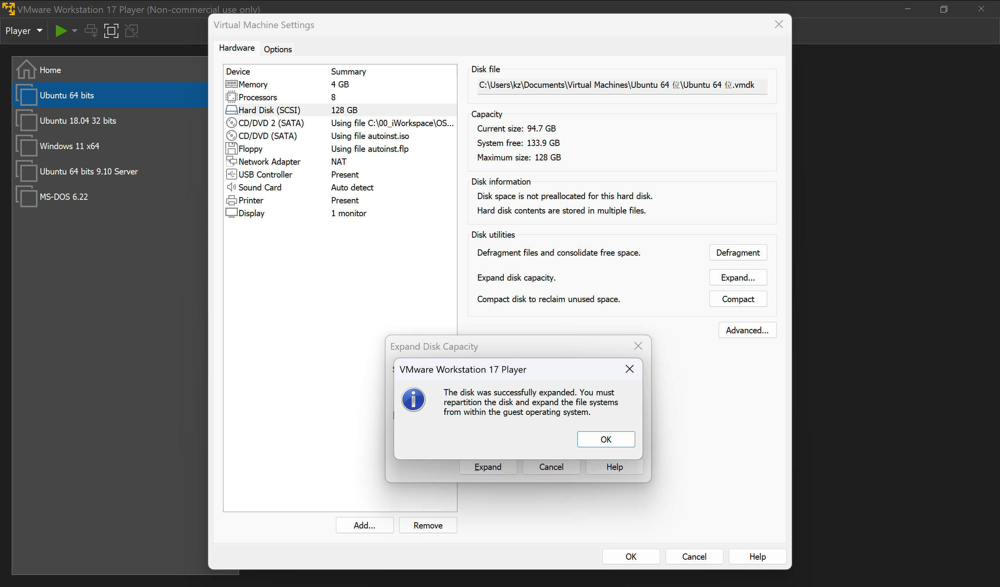
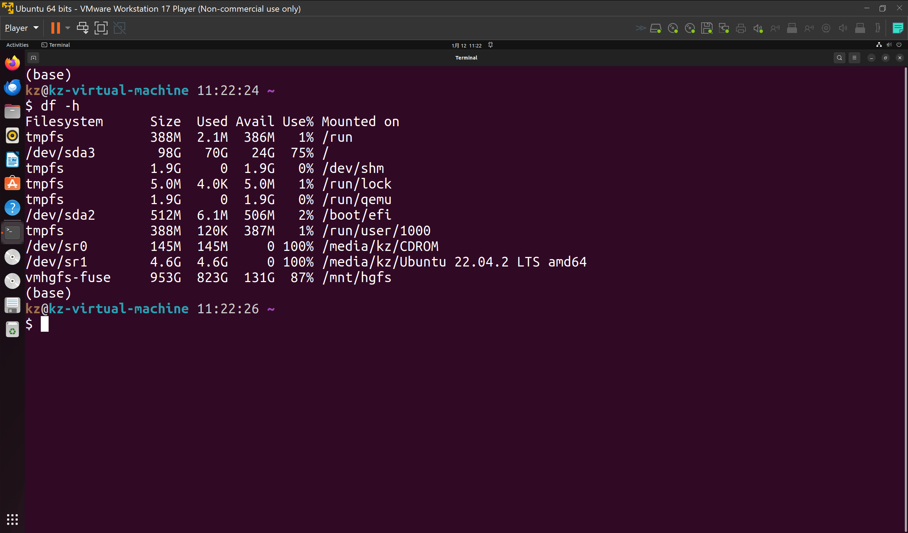
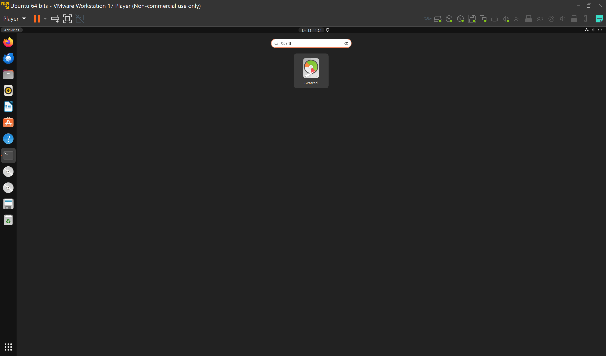
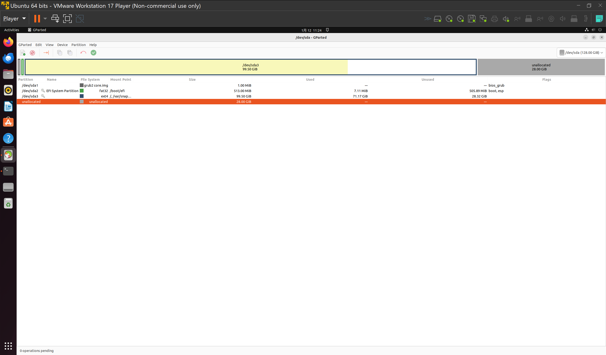
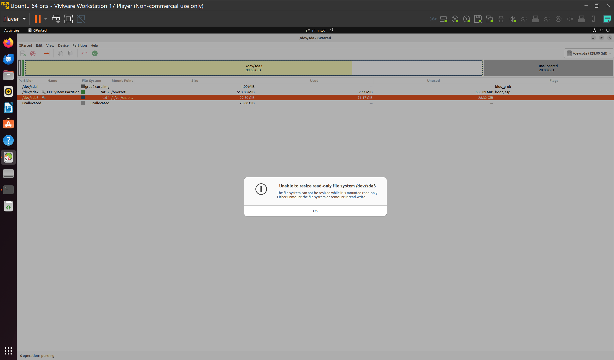

# How to Resize Hard Disk Size

- [How to Resize Hard Disk Size](#how-to-resize-hard-disk-size)
  - [Host change](#host-change)
    - [Power off Guest OS](#power-off-guest-os)
    - [Go to setting](#go-to-setting)
    - [Resizing HD](#resizing-hd)
    - [Repartition](#repartition)
    - [Result after operation](#result-after-operation)
  - [Guest OS Change](#guest-os-change)
    - [How to repartition Hard Disk](#how-to-repartition-hard-disk)

## Host change

### Power off Guest OS

### Go to setting

### Resizing HD

### Repartition

The most tricky problem:

1. Not aware of this notification and think with change above, expansion is complete.
2. Even got it and want do repartition, but failed to bootup guest OS.
   

### Result after operation

## Guest OS Change

### [How to repartition Hard Disk](002_How_to_Repartition_Hard_Disk.md)