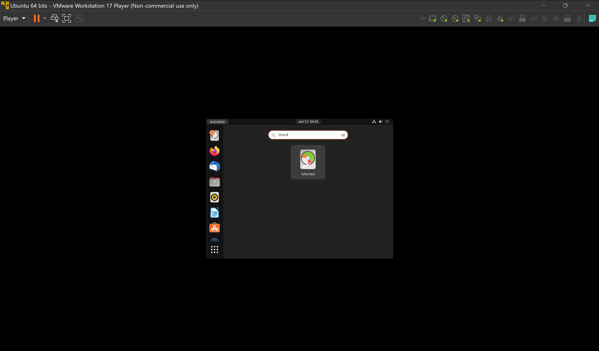
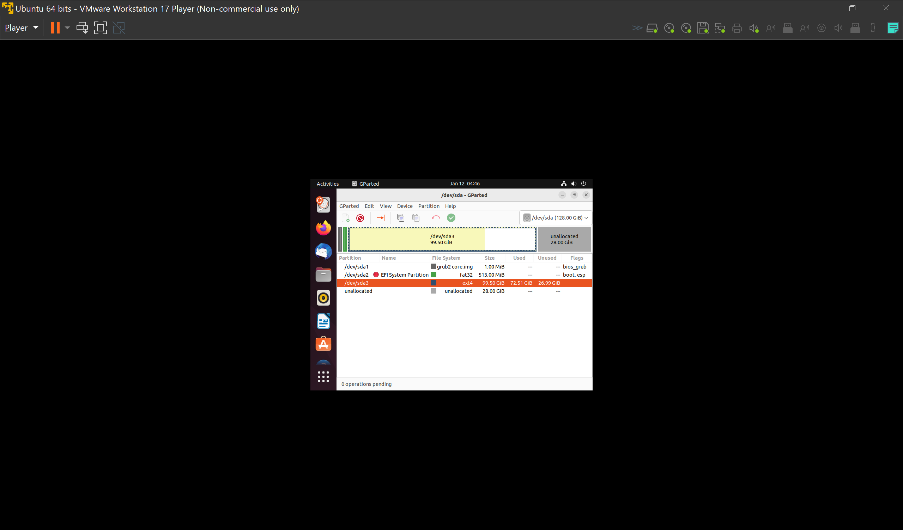
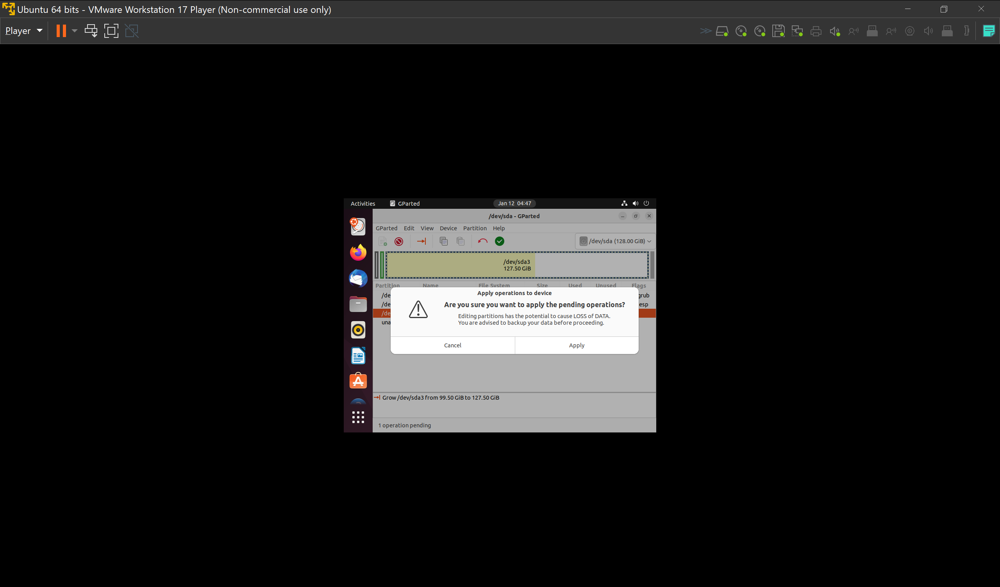

# How to Repartition Hard Disk

- [How to Repartition Hard Disk](#how-to-repartition-hard-disk)
  - [Repartition Step by Step](#repartition-step-by-step)
    - [Add a Ubuntu ISO to VM DVD](#add-a-ubuntu-iso-to-vm-dvd)
    - [Press F2 to BIOS](#press-f2-to-bios)
    - [BIOS Main Menu](#bios-main-menu)
    - [BIOS Boot Order](#bios-boot-order)
    - [BIOS CD First](#bios-cd-first)
    - [FPress F10 to save and exit](#fpress-f10-to-save-and-exit)
    - [Quit Installation](#quit-installation)
    - [Ubuntu Homescreen](#ubuntu-homescreen)
    - [Start GParted](#start-gparted)
    - [Check Unallocated](#check-unallocated)
    - [Partition Table](#partition-table)
    - [Select Partition to resize](#select-partition-to-resize)
    - [Drag to expand](#drag-to-expand)
    - [Apply Change](#apply-change)
    - [Applying Change](#applying-change)
    - [Applied Change](#applied-change)
    - [Restart Ubuntu](#restart-ubuntu)
    - [BIOS Boot Order Reversion](#bios-boot-order-reversion)
    - [BIOS Save and Reboot](#bios-save-and-reboot)
    - [Check New Partition Size with command](#check-new-partition-size-with-command)
    - [Check New Partition Size with GParted](#check-new-partition-size-with-gparted)

## Repartition Step by Step

### Add a Ubuntu ISO to VM DVD

### Press F2 to BIOS
Click mouse once to be in guest so that F2 is intercepted)

### BIOS Main Menu

### BIOS Boot Order

### BIOS CD First

### FPress F10 to save and exit

### Quit Installation
* If come to installation interface, quite it

* If come to Try Ubuntu/Install Ubuntu interface, select Try Ubuntu

### Ubuntu Homescreen

### Start GParted

### Check Unallocated

### Partition Table

### Select Partition to resize

### Drag to expand

### Apply Change

### Applying Change

### Applied Change

### Restart Ubuntu

### BIOS Boot Order Reversion

### BIOS Save and Reboot

### Check New Partition Size with command

### Check New Partition Size with GParted

