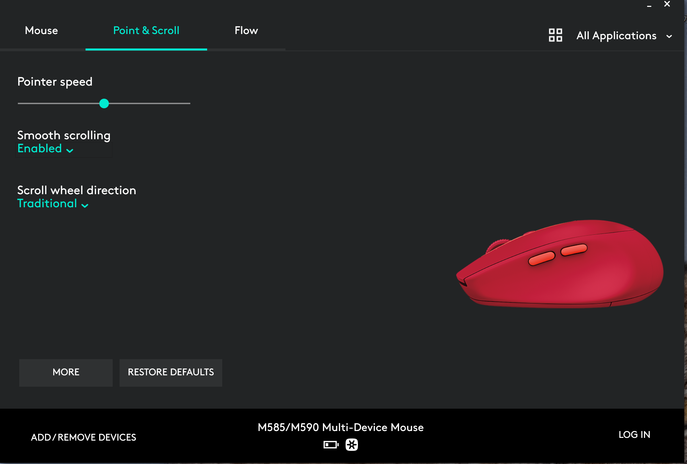
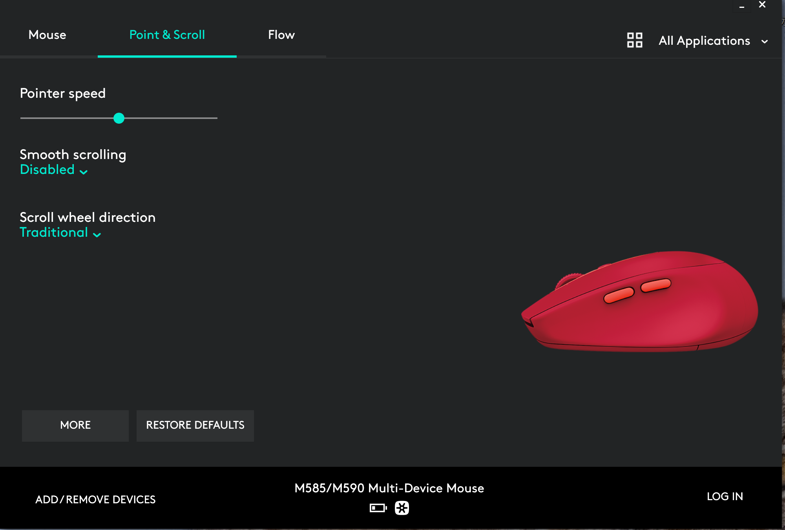

# Logi Mouse Scroll Wheel Not Working

- [Logi Mouse Scroll Wheel Not Working](#logi-mouse-scroll-wheel-not-working)
  - [Disable Smooth Scrolling](#disable-smooth-scrolling)

## Disable Smooth Scrolling

* By default, it is enabled
  
* Disable it to make scrolling work in VMware.
  
